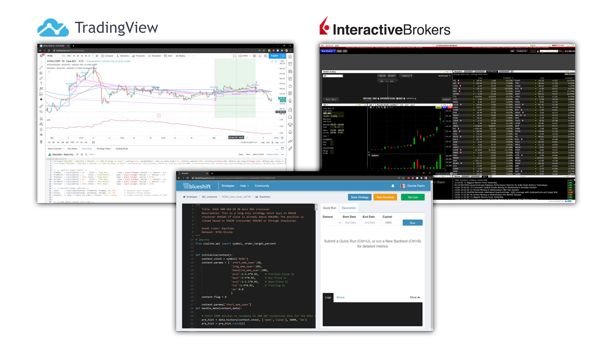
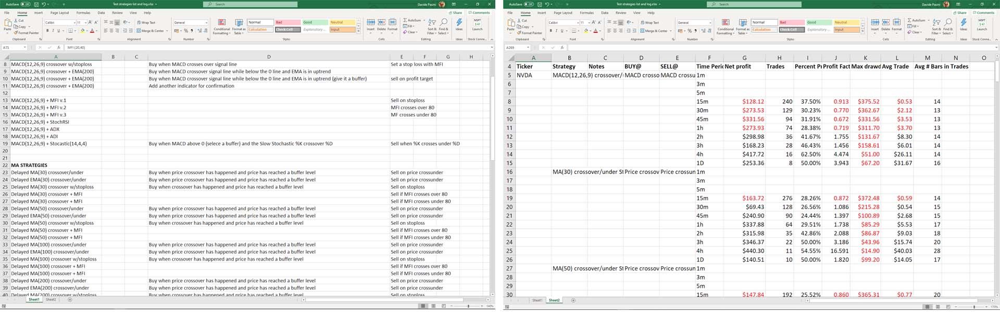
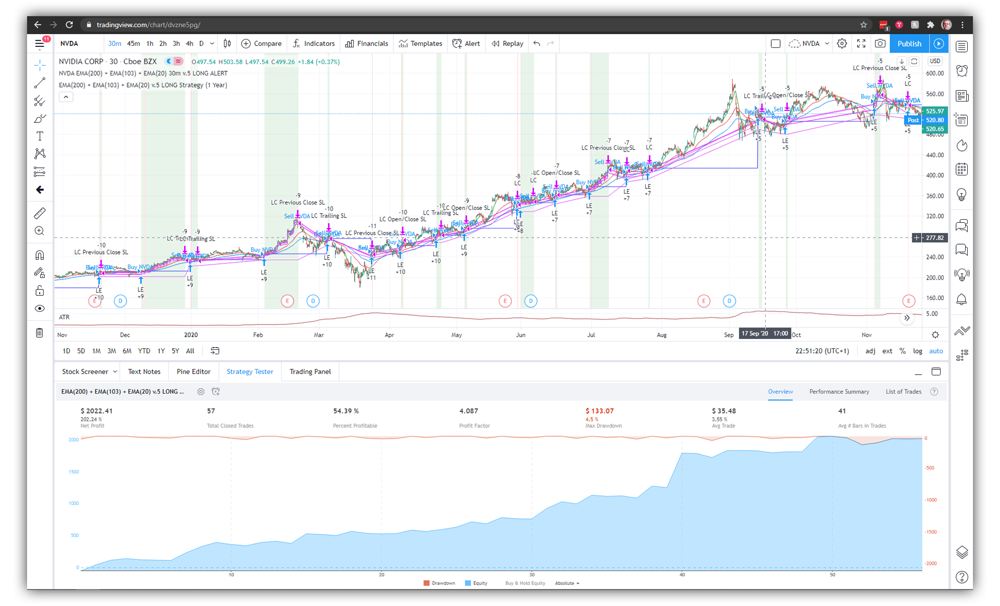

# NVDA_EMAs_crossover
Trading algorithm that places long positions when price is above the baseline EMA and the fast EMA crosses over the slow EMA. Position exits on a series of stoploss indicators.

# Strategy logic
I have built this specific strategy as my first attempt at algo trading. The eureka moment came by while I was trying to predict breakouts on stock like TSLA, avoiding flse signals. The initial idea was to identify MAs positive crossover and wait x amount of bars to confirm the positive trend and breakout(`reconsider this idea for other trend-following strategies`). I switched to NVDA because I realized that that the extremely good returns I was getting on TSLA were only due to the hype on the stock and that the strategy was not statistically reliable due to the lack of sufficient data back in time for backtesting. I so chose NVDA, a good innovative yet oligopolistic older company with great products and active R&D.

After playing around with several indicators, I took the approach of a deep learning model, i.e. test several indicators combinations and varying their levels, recording the strategy results (by hand in excel! :laughing:). Needless to say, loads of fun but eventually I determined what produced the best combinations and I proceed to overfitting. The inistial result on the curren year I was working was ~80% annual return (2019) and ~10% annual return the minimum a few years back. I was not formally aware of the concept of overfitting in ML (or of ML for that matter), but I realized I had to relax(normalize) the parameters, in a way that I could minimize the drawdowns in the worse years while being aware that this might reduce the gains in bullish moments. The following resulted:  

### ENTRY CONDITIONS
**Timeframe: 30T candles** 
Buy long when price is above 200-period EMA (Baseline EMA) and fast EMA (20-periods EMA) crosses over slow EMA (103-periods EMA)

> *The price above the baseline EMA assures that the stock is in a bullish phase, avoiding so taking trades while the ticker is bearish*

 
### EXIT CONDITIONS
While a very fast EMA crossover a very slow EMA often guarantees a trend inversion, when the inverse inversion (pardon the pun) happens, it is often already to late to abandon the trade then. A stoploss sistem had to be implemente but I came to realize that though a trailing stop loss already would help, there would often be situations in which it would back the strategy, exiting prematurely the trades when the trend was still strong (if too stringent). Repeating the same deep learning approach, I came up with and tested the following stoplosses:
condition | value | logic
--- | --- | ---
EMA crossunder | 20/103 | The fast EMA crosses under the slow EMA
Previous Close | 1,4% | Stoploss if price falls below the previous Close by 1,4%
Buy Price | 5% | Stoploss price falls below 5% of the Buy price of the current position
Open/Close | 1,2% | Stoploss if the price falls below the current candle Open by 1,2%
Trailing | 3% | Trailing stoploss

 
While covid-19 was beginning to hit Europe and USA I also introduced a no-trades limiter using an ATR (200 smooting period) set to 2.0, a level of volatility that was only surpassed only once in the past for NVDA. Looking back at what happened after then, even though volatility increased even farter and the ATR reached 6, the strategy continued to produce without losing more than it's average.
  

# Strategy returns

# Considerations
<code>Write here the first forward-test experience</code>

# Disclaimer
<code>(TBC)</code>
